# CrossSmudge ✒️

**CrossSmudge** is an open-source, extensible e-reader and micro-application firmware for ESP32 e-paper devices. 

Built upon the typography and reading enhancements of **[CrossInk](https://github.com/uxjulia/crossink)** and the rock-solid foundations of **[CrossPoint Reader](https://github.com/crosspoint-reader/crosspoint-reader)**, **CrossSmudge** introduces a lightweight **standalone Lua 5.4 application engine**, an **on-device App Store** for wireless app installations, a **browser-based web app manager**, and an expanding suite of games and utilities—all engineered to run within the strict hardware and memory limits of low-power e-ink hardware.

---

### Supported Devices

- **Xteink X3** (ESP32-C3, physical buttons, 800×480 monochrome e-ink)
- **Xteink X4** (ESP32-C3, physical buttons, 800×480 monochrome e-ink)
- **Xteink X4 Pro** (ESP32-S3, touch + SDMMC, PSRAM)
- **Xteink X4 Classic** (ESP32-S3, touch + physical buttons)
- **Seeed Studio reTerminal Sticky** (ESP32-S3, touch, PSRAM)

---

## What's New in CrossSmudge 🎮✨

### 🚀 Standalone Lua 5.4 Application Engine
Develop, share, and run custom applications directly from your SD card—**no firmware compilation or flashing required!**
* **Dynamic Discovery:** Drop an application folder into `/.crosssmudge/applications/` on your SD card, and it instantly appears in the on-device **Applications** launcher.
* **Full E-Paper Graphics API:** Complete `smudge.*` standard library providing high-contrast vector drawing, text wrapping, bitmap sprite rendering, modal dialogues, font selection, and hardware button/touch event handlers.
* **Hardware-Enforced Memory Safety:** Sandboxed Lua runtime calibrated for constrained ESP32-C3 microcontrollers (75 KB DRAM limit).

### 🛒 On-Device App Store (Over Wi-Fi)
Discover and install community-created applications directly on your device:
* Connect to Wi-Fi and open the **App Store** from the Applications menu.
* Browse the official community catalog hosted on GitHub with rich descriptions, version tags, author credits, and 64×64 preview icons.
* One-click **Install**, **Update**, and **Uninstall** directly over the air without connecting to a computer.

### 🌐 Web Portal Application Manager
Manage your device's apps from any desktop or mobile browser:
* Connect your device to your local Wi-Fi network and visit `http://<device-ip>/applications`.
* **Drag-and-Drop Installation:** Drag app directories or `.zip` bundles straight into the browser window to install them immediately.
* **Storage Manager:** View installed apps, versions, author information, storage footprint, and delete apps with one click.

### 🃏 Built-In & Community Applications
CrossSmudge includes a collection of e-paper applications and games:

| Application | Description |
| :--- | :--- |
| **Desk Stand** | Multi-layout ambient e-ink desk companion with 7 portrait and landscape styles, digital flip clock, daylight/year progress bars, monthly calendar, and auto-sleep suspension. |
| **Stopwatch** | Pixel cartoon stopwatch with mechanical crown plunger, workout facial expressions, digital LCD window, and comprehensive lap split recording. |
| **Hourglass** | Visual countdown sand timer with animated parabolic sand funnel crater, falling sand stream, conical sand mound, and cute expressive face. |
| **Solitaire** | Classic 7-column Klondike card game with stock, waste, foundations, and smooth multi-card dragging. |
| **Water Tracker** | Daily hydration tracker with an animated pixel cup character, configurable volume units, and 14-day history archive. |
| **Codex: Ink & Iron** | Full roguelike deckbuilding card RPG featuring 7 animated encounters, card rewards, relics, events, shop, and scriptorium. |
| **Blackjack** | Authentic casino blackjack with split pairs, double down, insurance, dealer AI, custom face-card sprites, and persistent bankroll. |
| **Divine Worship** | Complete daily prayer companion and liturgical psalter for the Anglican/Personal Ordinariate tradition with automated liturgical calendar computation. |
| **Block Drop** | E-ink optimized falling block puzzle with ghosting prevention, high scores, pause/resume, and reset modals. |
| **Wordle** | 5-letter word deduction game with interactive on-screen keyboard, letter hints, and win statistics. |
| **Sudoku** | Infinite procedural 9×9 logic puzzles with difficulty tiers, conflict highlights, and board generator. |
| **2048** | Classic 4×4 sliding tile puzzle with persistent state saving, smooth input debouncing, and high scores. |
| **Holy Rosary** | Interactive step-by-step prayer companion with high-resolution crucifix pixel art and bead tracking. |
| **Dice Simulator** | Multi-dice roller (d4, d6, d8, d10, d12, d20, d100, coin toss) with rolling animation and history log. |
| **Life Counter** | Multiplayer tabletop life tracker for *Magic: The Gathering* and card games with commander damage. |

### ⚙️ System & Firmware Enhancements
* **Front Button Navigation:** Unified physical button navigation across the App Store, Applications menu, and games (physical Up/Down/Select/Back controls).
* **Dedicated Over-The-Air (OTA) Updates:** Pointed directly to [CrossSmudge GitHub Releases](https://github.com/Mumfee/CrossSmudge/releases) for seamless one-tap firmware upgrades.
* **Low-Latency E-Paper Engine:** Custom partial refresh scheduling and waveform management to minimize ghosting during interactive gameplay.

---

## Screenshot Gallery 📸

<table>
  <tr>
    <td align="center" width="50%">
      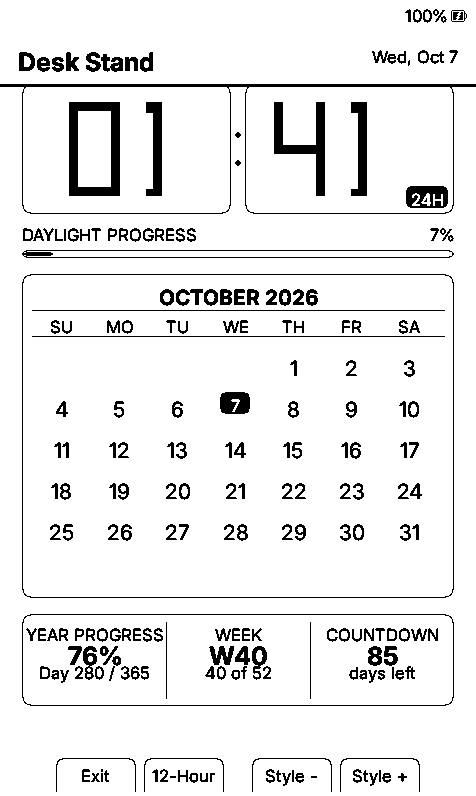<br/>
      <em>Desk Stand: Portrait Flip Clock & Calendar Station</em>
    </td>
    <td align="center" width="50%">
      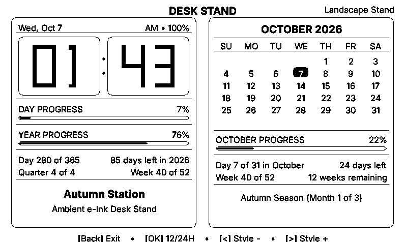<br/>
      <em>Desk Stand: 800×480 Side-by-Side Landscape Mode</em>
    </td>
  </tr>
  <tr>
    <td align="center" width="50%">
      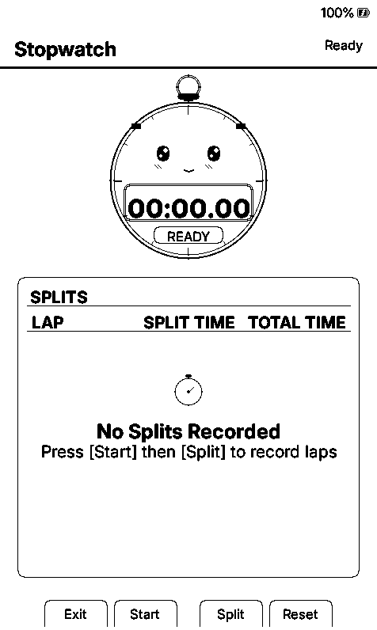<br/>
      <em>Stopwatch: Cartoon Character, LCD Timer & Splits</em>
    </td>
    <td align="center" width="50%">
      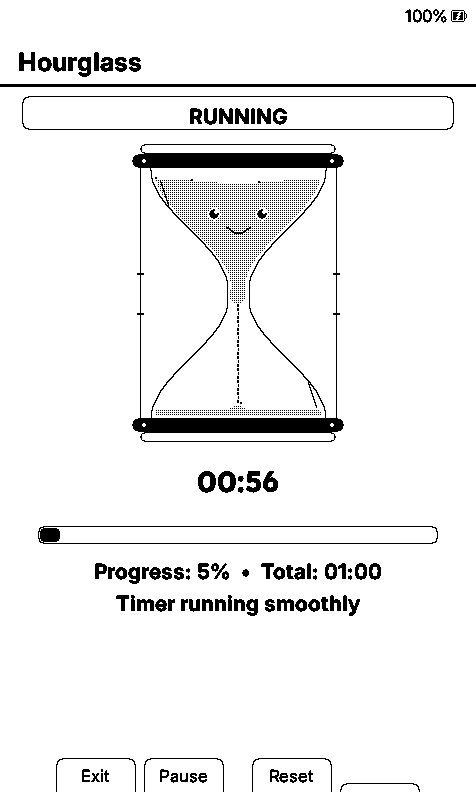<br/>
      <em>Hourglass: Dynamic Sand Funnel Crater & Stream</em>
    </td>
  </tr>
  <tr>
    <td align="center" width="50%">
      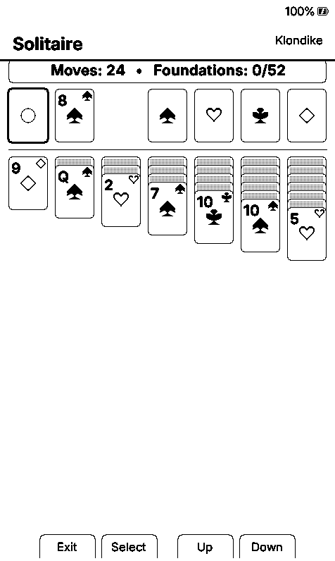<br/>
      <em>Solitaire: 7-Column Klondike Card Game</em>
    </td>
    <td align="center" width="50%">
      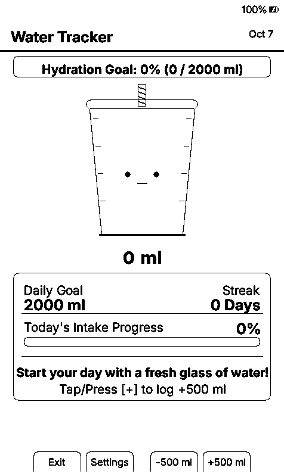<br/>
      <em>Water Tracker: Pixel Cup & Daily Hydration</em>
    </td>
  </tr>
  <tr>
    <td align="center" width="50%">
      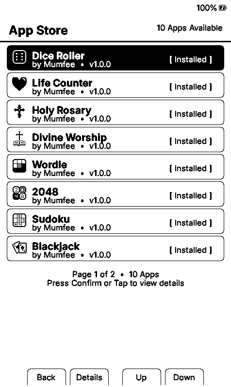<br/>
      <em>On-Device App Store: Wireless Community Catalog</em>
    </td>
    <td align="center" width="50%">
      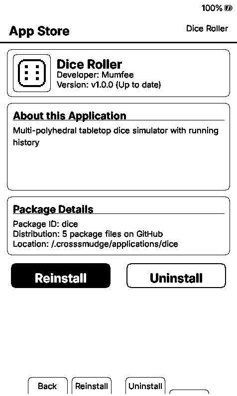<br/>
      <em>App Store: Detail View with 1-Click Install/Update</em>
    </td>
  </tr>
  <tr>
    <td align="center" width="50%">
      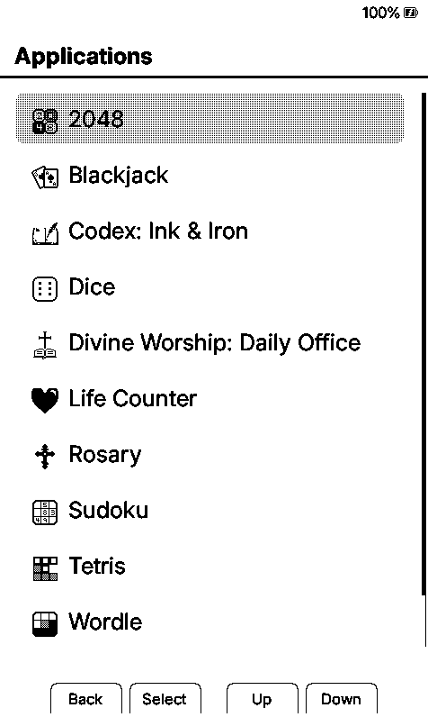<br/>
      <em>Applications Menu with High-Contrast Icons</em>
    </td>
    <td align="center" width="50%">
      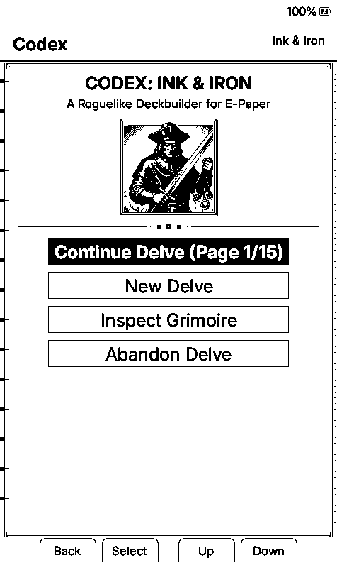<br/>
      <em>Codex: Ink & Iron (Roguelike Card Deckbuilder)</em>
    </td>
  </tr>
  <tr>
    <td align="center" width="50%">
      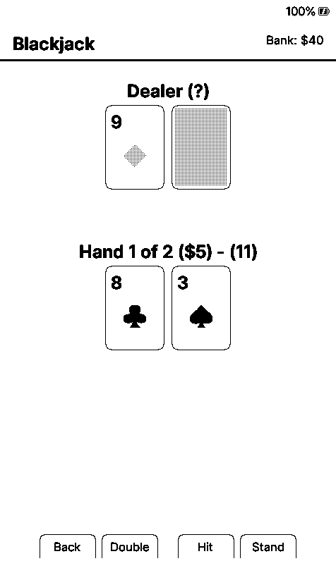<br/>
      <em>Blackjack: Split Pairs, Double Down & Card Sprites</em>
    </td>
    <td align="center" width="50%">
      <br/>
      <em>Divine Worship: Liturgical Daily Office & Psalter</em>
    </td>
  </tr>
  <tr>
    <td align="center" width="50%">
      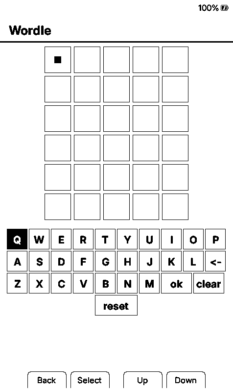<br/>
      <em>Wordle: E-Paper Keyboard & Word Deduction</em>
    </td>
    <td align="center" width="50%">
      <br/>
      <em>Sudoku: Procedural Generator & Contrast Grid</em>
    </td>
  </tr>
  <tr>
    <td align="center" width="50%">
      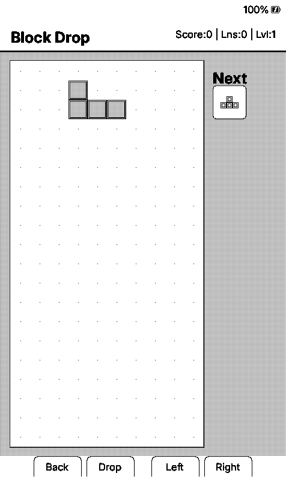<br/>
      <em>Block Drop: Fast E-Ink Partial Refresh Gameplay</em>
    </td>
    <td align="center" width="50%">
      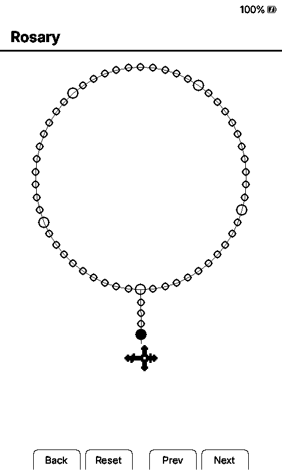<br/>
      <em>Holy Rosary: Bead Tracking & Crucifix Pixel Art</em>
    </td>
  </tr>
</table>

---

## Developer Guide: Building Your Own Apps 🛠️

CrossSmudge makes creating e-paper applications accessible to everyone. You do not need an ESP-IDF toolchain or C++ knowledge; any text editor is all you need to build standalone applications in **Lua 5.4**.

### 1. Application Anatomy
Every application is a folder placed inside `apps/<app_id>/` (or on your device in `/.crosssmudge/applications/<app_id>/`):

```text
my_app/
├── manifest.json       # Metadata: id, name, version, author, description
├── main.lua            # Entry point script with lifecycle callbacks
└── icon.raw            # (Optional) 32x32 1-bit monochrome icon (128 bytes)
```

#### `manifest.json`
```json
{
  "id": "my_app",
  "name": "My Application",
  "version": "1.0.0",
  "author": "YourGitHubUsername",
  "description": "A clean, functional e-paper utility for CrossSmudge.",
  "entry": "main.lua"
}
```

### 2. Quickstart Code Example (`main.lua`)
```lua
local count = 0
local width, height = 480, 800

function on_init()
    width, height = smudge.get_bounds()
    -- Load persisted state from device SD card
    count = tonumber(smudge.load("counter", "0")) or 0
end

function on_draw()
    smudge.clear()
    smudge.header("Counter App", string.format("Count: %d", count))

    -- Render centered card box and text
    local boxW, boxH = 260, 160
    local boxX = math.floor((width - boxW) / 2)
    local boxY = 280
    smudge.rounded_rect(boxX, boxY, boxW, boxH, 8, false, 2)
    smudge.centered_text(boxY + 50, tostring(count), "ui12", "bold", true)
    smudge.centered_text(boxY + 100, "Press Select to increment", "small", "regular", true)

    -- Bottom button hint labels
    smudge.button_hints("Exit", "+ 1", "Reset", "")
end

function on_button(btn, pressed)
    if not pressed then return end

    if btn == "back" then
        smudge.save("counter", tostring(count))
        smudge.exit()
    elseif btn == "confirm" then
        count = count + 1
        smudge.request_update()
    elseif btn == "left" then
        count = 0
        smudge.request_update()
    end
end

function on_exit()
    smudge.save("counter", tostring(count))
end
```

### 3. The `smudge.*` API Overview
The sandboxed runtime provides a focused set of graphics, layout, input, and persistence APIs:
- **Display & Drawing:** `smudge.clear()`, `smudge.request_update()`, `smudge.rect()`, `smudge.rounded_rect()`, `smudge.circle()`, `smudge.line()`, `smudge.draw_bitmap_1bit()`.
- **Typography & UI:** `smudge.text()`, `smudge.centered_text()`, `smudge.wrapped_text()`, `smudge.header()`, `smudge.button_hints()`, `smudge.modal()`.
- **System & State:** `smudge.load(key, default)`, `smudge.save(key, val)`, `smudge.get_bounds()`, `smudge.time()`, `smudge.exit()`.

👉 **[Read the Full Application Developer Guide (500+ lines of documentation & API specifications)](./apps/README.md)**

### 4. Mandatory Hardware Constraint Testing
Because physical ESP32-C3 devices have approximately 380 KB of total RAM with **75 KB of DRAM allocated for the Lua heap**, you must test your app under exact hardware limits before deployment:

```bash
# Build the native simulator
pio run -e simulator

# Launch the simulator with enforced 75 KB hardware DRAM ceiling
SMUDGE_X3_CONSTRAINTS=1 .pio/build/simulator/program
```
If your application leaks memory or exceeds 75 KB, the simulator will immediately catch it.

---

## How to Submit Your App to the Official App Store 🌐

Want to share your creation with all CrossSmudge users worldwide?

1. **Verify Your App:** Ensure your app lives in `apps/<your_app_id>/` and runs cleanly with `SMUDGE_X3_CONSTRAINTS=1`.
2. **Add to `apps/catalog.json`:** Add an entry for your application to [`apps/catalog.json`](./apps/catalog.json):
   ```json
   {
     "id": "your_app_id",
     "name": "Your App Name",
     "version": "1.0.0",
     "author": "YourGitHubHandle",
     "description": "One-line summary of what your application does.",
     "files": [
       "manifest.json",
       "main.lua",
       "icon.raw"
     ]
   }
   ```
3. **Submit a Pull Request:** Open a PR against the `main` branch of [https://github.com/Mumfee/CrossSmudge](https://github.com/Mumfee/CrossSmudge).
4. **Instant Distribution:** As soon as your PR is merged, your app appears immediately in the on-device **App Store** on every Wi-Fi connected CrossSmudge device worldwide!

---

## Core Reading Features & Typography (CrossInk Heritage) 📖

CrossSmudge preserves the reader improvements and typography enhancements originally created in **[CrossInk](https://github.com/uxjulia/crossink)**:

<table>
  <tr>
    <td align="center">
      <br/>
      <em>Font: Bitter, Size: 12 pt, Margin: 15</em>
    </td>
    <td align="center">
      <br/>
      <em>Reading Stats with customizable front button mapping</em>
    </td>
  </tr>
</table>

### Reading & Typography Highlights
- **Curated E-Paper Typefaces:** Default body fonts replaced with [Lexend Deca](https://fonts.google.com/specimen/Lexend+Deca) and [Bitter](https://fonts.google.com/specimen/Bitter) for maximum legibility and reduced ghosting. UI rendered with [Inter](https://fonts.google.com/specimen/Inter).
- **Music & Supplemental Glyphs:** Comprehensive glyph set supporting music notation, selected Cyrillic characters, and *Project Hail Mary* CJK fallback ranges.
- **Reading Statistics:** Total books finished, reading time, sessions, pages turned, and reading speed metrics, viewable on-demand or as a customized sleep screen.
- **Enhanced EPUB Rendering:** Thicker underlines, `<hr>` section breaks, redaction markup rendering, and improved simple tables.
- **Focus Reading & Guide Dots:** Optional visual reading aids for tracking lines and reducing eye fatigue.
- **Custom Button Actions:** Complete mapping for front buttons, side switches, short power clicks, and long-press shortcuts.
- **Finished Book Tracking:** Automatically prompts when reaching 99% of a book, tracks completion stats, and offers to organize completed titles into a "Read" folder.
- **Cross-Device Sync:** Synchronize reading progress and all-time reading stats wirelessly between two devices over local Wi-Fi.

---

## Installation & Flashing ⚡

### Method 1: In-Browser Web Flasher (Recommended)
You can flash CrossSmudge directly from any Chromium browser (Google Chrome, Microsoft Edge, Opera, or Brave) using WebSerial — no command-line tools or drivers needed!

1. Download the latest `firmware-*.bin` for your device model from the **[CrossSmudge Releases](https://github.com/Mumfee/CrossSmudge/releases/latest)**:
   - **Xteink X3 / X4**: `firmware-x3-x4-v1.6.5.3.bin`
   - **Xteink X4 Pro**: `firmware-x4-pro-v1.6.5.3.bin`
   - **Xteink X4 Classic**: `firmware-x4-classic-v1.6.5.3.bin`
   - **Seeed Studio Sticky**: `firmware-sticky-v1.6.5.3.bin`
2. Connect your device to your computer using a USB-C data cable and ensure the device is powered on.
3. Open the **CrossPoint Web Flasher**:
   👉 **[https://crosspointreader.com/#flash-tools](https://crosspointreader.com/#flash-tools)**
4. Select your device model from the list (e.g. *XTEINK X4/X3*, *XTEINK X4Pro*, or *reTerminal Sticky*).
5. Under the firmware selection, click **"Custom .bin"** (*Upload file*).
6. Select your downloaded `firmware-*.bin` file and click **Flash**!

*(You can also use the official [Espressif Web Flasher](https://espressif.github.io/esptool-js/) with flash address `0x10000`).*

### Method 2: On-Device SD Card Firmware Update (Zero PC Tools)
If you already have CrossPoint, CrossInk, or CrossSmudge installed:
1. Download the `firmware-*.bin` file for your device from the **[CrossSmudge Releases](https://github.com/Mumfee/CrossSmudge/releases/latest)**.
2. Copy the `.bin` file onto your SD card (it can be placed in root or any folder).
3. On your device, open **Settings → System → SD Card Firmware Update**.
4. Select the `.bin` file to install and restart.

### Method 3: Over-The-Air (OTA) Updates
If your device is already running CrossSmudge and connected to Wi-Fi, open **Settings → Firmware Update** to check for and install the latest release wirelessly.

### Method 4: Command Line (`esptool.py`)
For terminal users on macOS or Linux:
```bash
# For ESP32-C3 (Xteink X3 / X4):
esptool.py --chip esp32c3 write_flash 0x10000 firmware-x3-x4-v1.6.5.3.bin

# For ESP32-S3 (X4 Pro / Sticky / X4 Classic):
esptool.py --chip esp32s3 write_flash 0x10000 firmware-x4-pro-v1.6.5.3.bin
```

---

## Development & Building from Source 💻

### Prerequisites
- [PlatformIO Core](https://platformio.org/install/cli) or PlatformIO IDE extension.
- Git with submodule support.

### Clone and Initialize
```bash
git clone https://github.com/Mumfee/CrossSmudge.git
cd crosssmudge
git submodule update --init --recursive
```

### Build Targets

| Command | Target Device / Platform |
| :--- | :--- |
| `pio run -e default` | Xteink X3 / X4 (ESP32-C3, physical buttons) |
| `pio run -e sticky` | Seeed Studio reTerminal Sticky (ESP32-S3, touch, PSRAM) |
| `pio run -e x4-pro` | Xteink X4 Pro (ESP32-S3, touch + SDMMC, PSRAM) |
| `pio run -e simulator` | Native desktop simulator (SDL2) |

### Flash via USB
```bash
pio run -e default --target upload
```

### Nix / NixOS
A Nix flake and shell are provided:
```bash
nix develop -f nix
# or
nix-shell nix
```

---

## Repository Structure 📂

- `src/` — Main application logic, activity manager, UI themes, and screen activities (Reader, Home, App Store, Settings, Network).
- `apps/` — Lua application ecosystem, manifests, icons, and official community catalog (`catalog.json`).
- `lib/` — Core firmware libraries (EPUB parser/layout, fonts, i18n, filesystem helpers, HAL abstractions).
- `freeink-sdk/` — Nested hardware SDK submodule providing low-level display, power, and board drivers.
- `web/` — Web portal sources (HTML templates, CSS styles, JavaScript app manager); compiled into C++ headers by `scripts/build_web.py`.
- `docs/` — System architecture documentation, user guides, controls, and developer tutorials.
- `scripts/` — Tooling for icon generation, translation builds, web packaging, and release automation.
- `test/` — Unit test suites and native simulator fixtures.

---

## Acknowledgments & Upstream Credits 🤝

CrossSmudge stands on the shoulders of giants:
- **[CrossInk](https://github.com/uxjulia/crossink)** by **Julia (@uxjulia)** — For the reader typography, reading statistics, focus reading modes, and design sensibilities that form the core reading experience.
- **[CrossPoint Reader](https://github.com/crosspoint-reader/crosspoint-reader)** — For the original open-source ESP32 e-reader architecture and EPUB engine.
- **[FreeInk SDK](https://freeink.org/)** — For the underlying hardware drivers and e-paper display abstractions.

---

## License

CrossSmudge is open-source software licensed under the **GNU General Public License v3.0 (GPL-3.0)**. See [`LICENSE`](./LICENSE) for full details.
